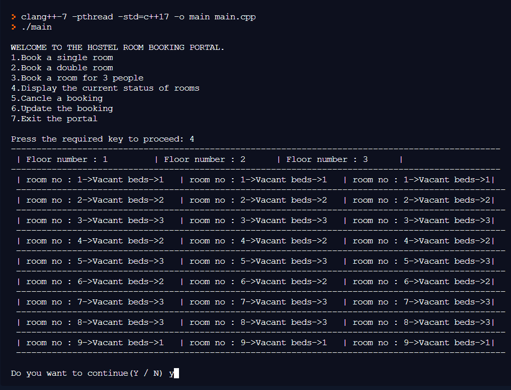

<h1 id="top" align="center">  HOSTEL ROOM BOOKING SYSTEM</h1>

## Project Description 

This project also keeps details of thehostellers and applied students. The Online Hostel seat Booking System helps in booking the seats in the hostels. It will simplify the work of the institutions in getting the seats booked in the hostels with great ease.
This system is designed to support the hostel management which helps them to save the records of the students about their rooms and vacant rooms in the hostel.
## Advantages 
* **Automation** - It save them from the tons of manual work from which it is very difficult to find the record of the students and the information of about the those who had left the hostel years ago.
* **Well-Organized** - This will help in maintaining the seats present in the hostels in a well organized way. 
* **Transparency** - The system maintains Transparency between the students and the college.

## Problem Statement
There are a lot of drawbacks in keeping and maintaining a hostel. Especially with a manualsystem. Since most hostels are being run by only one hostel manager, the number of studentsin a room are sometimes not known by the officer. He has to go room by room to ensure thata room is occupied or not. Sometimes people may be owing in the hostel and they are savedon papers or huge notebooks, and sometimes receipts. If the books should go missing orstolen, one would never be able to know if a student is owing or not. Room allocation alsobecomes a problem as the officer might not know which rooms are available or not. Andsome hostels have a lot of rooms or have mare storeys and it would be very tedious to gothrough all storeys in search of a free room for an applicant. Also the officer might not knowthe number of students in a room or know if a room is full or not.

## Functioning
* Displaying the status of the rooms
* Booking Options for various types of rooms
* Updating the information

<h1 id="top" align="center"> </h1>

[BACK TO TOP ↑](#top)
